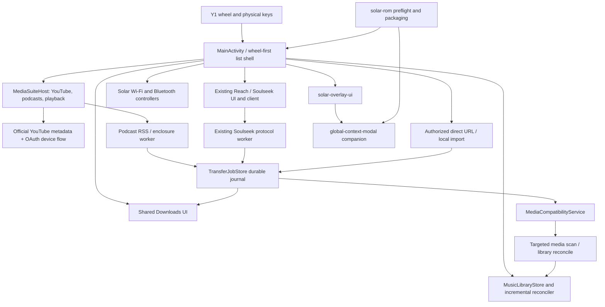

# Solar architecture for the Y1 work

The existing Solar application is the authoritative foundation. This branch
adds narrow policy, persistence, diagnostics, and provider-specific helpers
around working behavior; it does not rename the project or replace its Android
Views architecture.

## Boundaries

### UI and input

`MainActivity` remains the established screen coordinator. Wheel policies,
keyboard controllers, and text-editor state are small testable classes.
`MediaSuiteHost` owns media-suite screens without creating another activity
stack. Navigation remains text-first and preserves query/focus state.

### Acquisition providers

Provider-specific sockets and APIs stay in their existing components:

- Soulseek uses the existing `SoulseekClient` and Reach stores.
- Podcasts use RSS/Podcast Index and enclosure workers.
- Authorized HTTP downloads use `AuthorizedDirectDownload`.
- User files use `AuthorizedMediaImporter`.
- YouTube uses official metadata APIs only and has no media-acquisition path.

All active acquisitions report the same `TransferJobStore` state model. The
journal does not duplicate provider workers; it gives the Downloads UI stable
pause/resume/retry/history behavior across process death.

### Compatibility and indexing

`MediaCompatibilityService` chooses the platform decoder, the existing IJK
fallback, or a precise unsupported result. It does not pretend to transcode.
Completed files are finalized before a targeted media scan and incremental
library reconciliation.

### Network and privacy

API-17-compatible OkHttp plus Conscrypt is the common modern TLS path.
YouTube metadata caching/quota/retry, Wi-Fi recovery, Bluetooth diagnostics,
and redacted error policies are isolated from list rendering. Credentials and
raw provider resume identifiers are not UI fields.

### Platform and ROM

`solar-overlay-ui`, `global-context-modal`, and `launcher-helper` keep their
existing roles. The platform-asset manifest pins embedded APK hashes. ROM
packaging is downstream of a read-only Type A/Type B preflight and release
signing; application development does not require a ROM flash.

